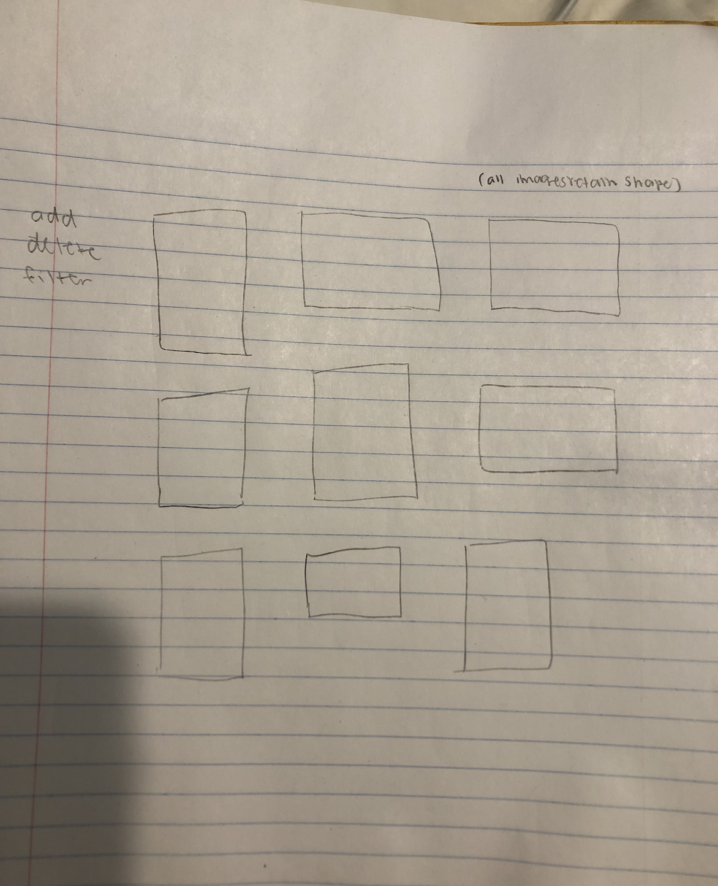
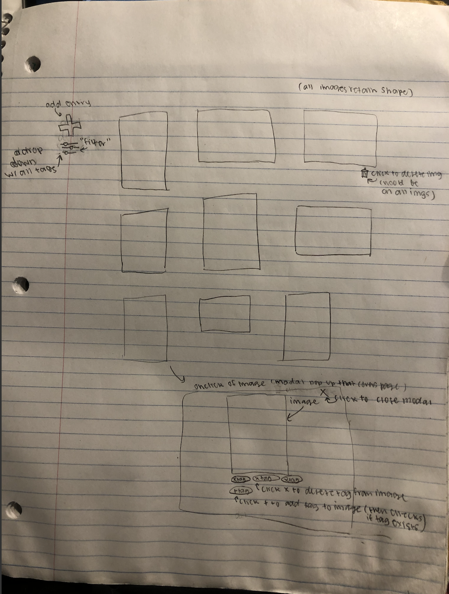

# Project 3: Design Journey

Be clear and concise in your writing. Bullets points are encouraged.

**Everything, including images, must be visible in VS Code's Markdown Preview.** If it's not visible in Markdown Preview, then we won't grade it.

# Design & Plan (Milestone 1)

## Describe your Gallery (Milestone 1)
> What will your gallery be about? 1 sentence.


It will be a gallery of my photographs with different tags for genre of photography used.

> Will you be using your existing Project 1 or Project 2 site for this project? If yes, which project?

No.

> If using your existing Project 1 or Project 2, please upload sketches of your final design here.


## Target Audience(s) (Milestone 1)
> Tell us about your target audience(s).

My target audience will be future potential employers looking for compositional/aestethetic as well as programming skill as I will want to use this in my portfolio.

## Design Process (Milestone 1)
> Document your design process. Show us the evolution of your design from your first idea (sketch) to design you wish to implement (sketch). Show us the process you used to organize content and plan the navigation (card sorting), if applicable.
> Label all images. All labels must be visible in VS Code's Markdown Preview.
> Clearly label the final design.




## Design Patterns (Milestone 1)
> Explain how your site leverages existing design patterns for image galleries.
> Identify the parts of your design that leverage existing design patterns and justify their usage.
> Most of your site should leverage existing patterns. If not, fully explain why your design is a special case (you need to have a very good reason here to receive full credit).

I use thumbnails upon first looking at the page because it give
me a way to display all images to the use without having to download the full images to do so, giving it a traditional gallery
layout. I use a "+" to make a button to add a new photo entry and a trashcan icon (that Ill make in photoshop) to indicate to the user that they can delete the photo. By tapping on the photo,
I enlarge the photo on top of the preexisting site, darkening the  abckground which is a popular design pattern used by many image galleries to let the user see the photo in full. To leave the "modal" I have included a "x" button that intuitively the user will know to close the modal and the enlarged photo to go back to the gallery. To filter via tags, I  have included a filter icon (that I will also make in ps but is copied after a standard filter icon) that once clicked, will show a dropdown of available tags and once a tag  is selected, will show only photos that have that tag hense "filtering". To add a tag, under the photo will be an
oval icon that say "+ tag", alluding to a user's familiar association of  + with  adding or creating something new. Once the  user click  on this, they  will be able to type in a new tag and  when  they  try  to submit,  the  tag will be checked to make s re its unique. To delete a tag, simply click the x next to any tag name  ex:"x water" and that will get rid of the tag water on that image again using the design pattern for "x" which removes or deletes.

## Requests (Milestone 1)
> Identify and plan each request you will support in your design.
> List each request that you will need (e.g. view image details, view gallery, etc.)
> For each request, specify the request type (GET or POST), how you will initiate the request: (form or query string param URL), and the HTTP parameters necessary for the request.

Example:
- Request: sort by specific tag
  - Type: GET
  - Params: tag_id (images.id in DB)
- Request: add tag
  - Type: POST
  - Params: tag_id (form)
- Request: delete tag
  - Type: GET
  - Params: tag_id (images.id in DB)
- Request: add image
  - Type: POST
  - Params: tag_id (form)
- Request: delete image
  - Type: GET
  - Params: image_id (images.id in DB)


## Database Schema Design (Milestone 1)
> Plan the structure of your database. You may use words or a picture.
> Make sure you include constraints for each field.

> Hint: You probably need `images`, `tags`, and `image_tags` tables.

> Hint: For foreign keys, use the singular name of the table + _id. For example: `image_id` and `tag_id` for the `image_tags` table.


Example:
```
movies (
id : INTEGER {PK, U, Not, AI}
field2 : ...
...
)
```
images (
  id : INTEGER {PK, U, Not, AI}
  user_id : INTEGER {Not, Not, Not, Not}
  tag_id : INTEGER {Not, U, Not, Not}
)

tags (
  tag_id : INTEGER {PK, U, Not, AI}
  tname : TEXT {Not, Not, Not, Not}

)

## Database Query Plan (Milestone 1)
> Plan your database queries. You may use natural language, pseudocode, or SQL.
> Using your request plan above, plan all of the queries you need.

add new image entry to images, generate new id, save image as id.jpg
insert into tags where tname = ""  tag_img_id = image id
remove from tags where tname = ""  tag_img_id = image id
remove image entry to images, remove id

## Code Planning (Milestone 1)
> Plan what top level PHP pages you'll need.

just the index.php as the photos will open up on the same page

> Plan what partials you'll need.

I don't think I'll need partials since its all going to be on the same page.

> Plan any PHP code you'll need.

Example:
```
Put all code in between the sets of backticks: ``` code here ```

if the user adds image (SELECT user_id from images WHERE id = the number) then ADD img_id (pk), user_id to images

if the user deletes image (SELECT user_id from images WHERE id = the number) then REMOVE img_id, user_id, tag_id, in images

if the user adds tag to image (SELECT id from images WHERE id = the number) then ADD tag_id to image's row in images

if the user deletes tag on an image (SELECT id from images WHERE id = the number) then REMOVE tag_id to image's row in images

```

# Complete & Polished Website (Final Submission)

## Gallery Step-by-Step Instructions (Final Submission)
> Write step-by-step instructions for the graders.
> For each set of instructions, assume the grader is starting from index.php.

Viewing all images in your gallery:
1. hit view everything


View all images for a tag:
1. hit a particular tag


View a single image and all the tags for that image:
1. its in the gallery


How to upload a new image:
1. press the plus button above


How to delete an image:
1. type in image name


How to view all tags at once:
1. hit the dropdown


How to add a tag to an existing image:
1. click the add button and add an image
2.

How to remove a tag from an existing image:
1.
2.


## Reflection (Final Submission)
> Take this time to reflect on what you learned during this assignment. How have you improved since starting this class?

I've learned a lot about the back end process.
